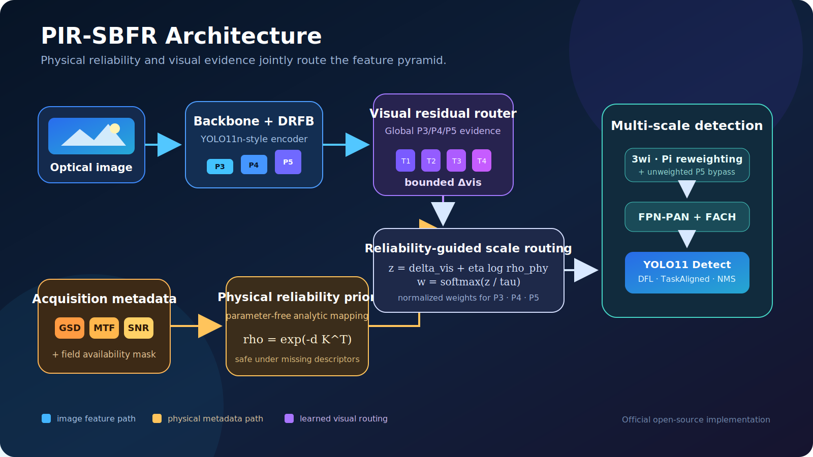
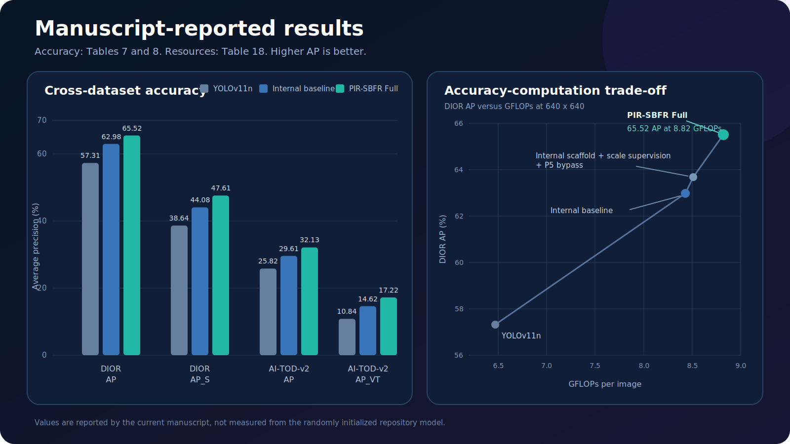
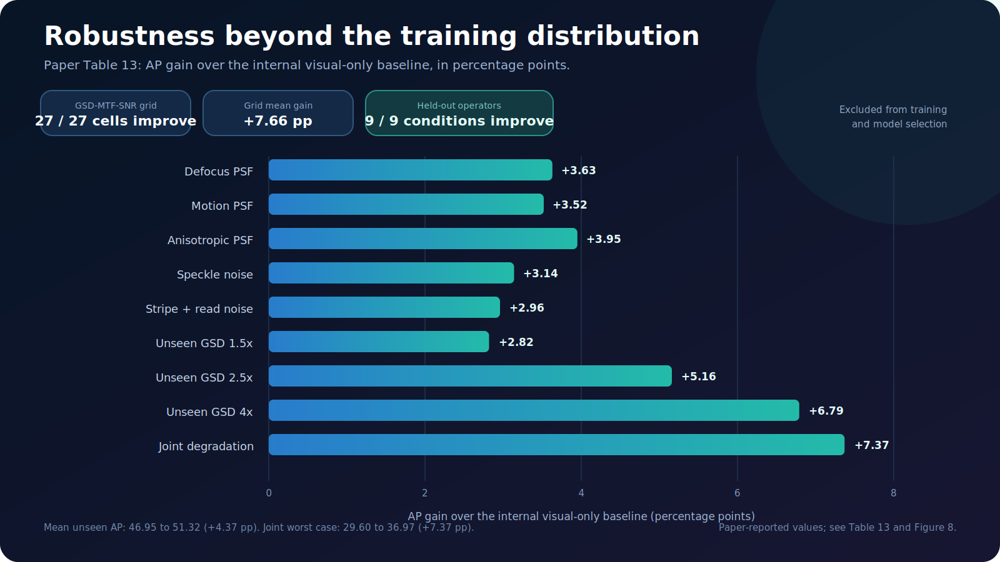
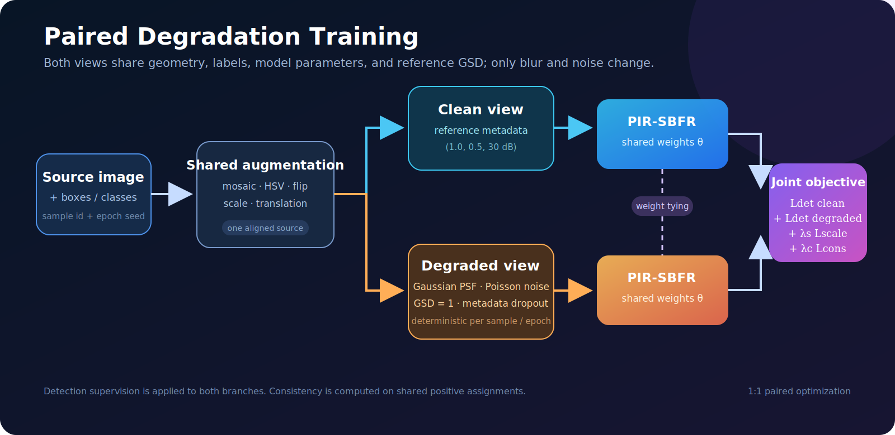
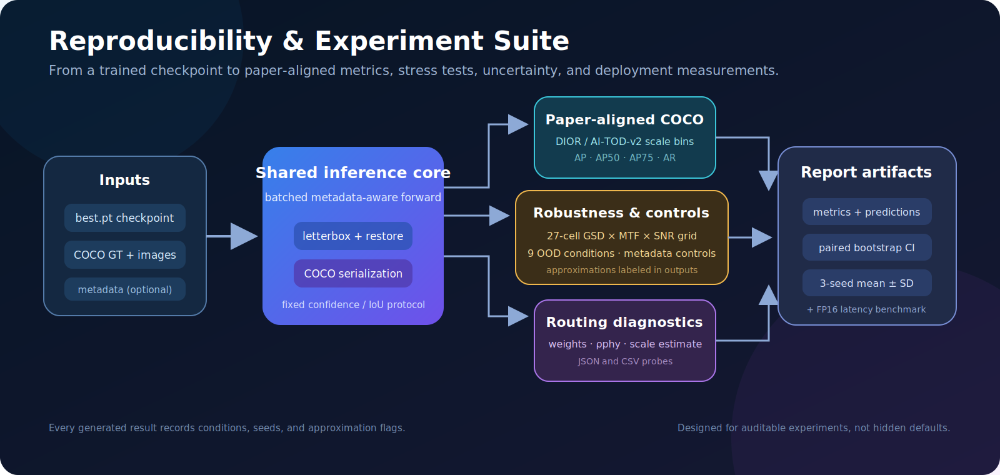

# From Image Formation to Feature Routing: PIR-SBFR

The official open-source implementation of *PIR-SBFR for Observation-Constrained Multiscale Evidence Allocation in Optical Remote Sensing*, released by the paper authors.


**[Paper-to-code specification](docs/PAPER_SPEC.md) · [Reproducibility protocol](REPRODUCIBILITY.md)**



This repository implements the model, paired-degradation training procedure, complete loss, DIOR and AI-TOD-v2 data conversion, paper-specific COCO evaluation, robustness experiments, metadata controls, statistical analysis, and deployment-oriented efficiency benchmarks described in the original PIR-SBFR paper. The paper PDF is not redistributed in this repository.

> [!IMPORTANT]
> This is the **official open-source codebase released by the PIR-SBFR paper authors**. It contains the model, training pipeline, evaluation tools, experiment configurations, and documented implementation choices used for the public release. Dataset files, the paper PDF, pretrained weights, and private flight data are not redistributed; see [`docs/PAPER_SPEC.md`](docs/PAPER_SPEC.md) and [`REPRODUCIBILITY.md`](REPRODUCIBILITY.md) for the implementation mapping and complete experiment protocol.

## Table of contents

- [Implementation at a glance](#implementation-at-a-glance)
- [Paper-reported results](#paper-reported-results)
- [Method overview](#method-overview)
- [What is implemented](#what-is-implemented)
- [Installation](#installation)
- [Quick verification](#quick-verification)
- [Dataset preparation](#dataset-preparation)
- [Acquisition metadata format](#acquisition-metadata-format)
- [Training](#training)
- [Inference](#inference)
- [COCO evaluation](#coco-evaluation)
- [Experiment suite](#experiment-suite)
- [Configuration and ablations](#configuration-and-ablations)
- [Outputs and experiment records](#outputs-and-experiment-records)
- [Tests and validation](#tests-and-validation)
- [Repository layout](#repository-layout)
- [Release scope and reproducibility](#release-scope-and-reproducibility)
- [Troubleshooting](#troubleshooting)
- [License and citation](#license-and-citation)

## Implementation at a glance

| Component | Status | Implementation |
| --- | --- | --- |
| PIR-SBFR detector | Complete | YOLO11n-style backbone, DRFB, dual-source router, FPN-PAN, P5 bypass, FACH, YOLO11 Detect |
| Physical reliability prior | Complete | Parameter-free GSD, Nyquist MTF, and SNR mapping with field-level availability masks |
| Visual residual router | Complete | `K=4` residual experts, learned expert gate, scale supervision, and logit-space fusion |
| Paired degradation training | Complete | Aligned clean/degraded views, Gaussian PSF, Poisson noise, sampling degradation, metadata dropout |
| Training objective | Complete | YOLO detection loss, scale KL, and shared-positive class/box consistency |
| Dataset conversion | Complete | DIOR VOC and AI-TOD-v2 COCO to YOLO, COCO ground truth, category mapping, and audit report |
| Paper-aligned evaluation | Complete | COCOeval with dataset-specific scale intervals and maximum-detection limits |
| Robustness experiments | Complete | 27-cell grid, nine approximate OOD conditions, metadata controls, paired bootstrap |
| Efficiency measurement | Complete | Parameter count, direct `640×640` FLOPs, and CUDA FP16 batch-1 forward latency |
| Pretrained weights | Not included | Train from scratch with the documented three-seed protocol |

### Parameter and compute calibration

The default `nc=20` model was profiled by passing a real `640×640` tensor through the complete network:

| Metric | This implementation | Paper | Relative difference |
| --- | ---: | ---: | ---: |
| Parameters | 3,944,613 | 3.942 M | approximately 0.07% |
| FLOPs | 8.8353 G | 8.82 G | approximately 0.17% |

This close agreement verifies that the released implementation matches the model scale reported in the paper.

## Paper-reported results

> [!NOTE]
> These charts are original redraws of the current paper's Figure 5 and Tables 6, 7, 13, and 17; the observation-grid summary comes from Figure 8. All accuracy values are percentages and all deltas are percentage points. AP entries with uncertainty are three-seed means ± sample SD. These are published results, not measurements from the randomly initialized repository model.



### Benchmark accuracy

| Dataset and metric | YOLOv11n | YOLO-DSF | PIR-SBFR Full | Delta vs. YOLO-DSF | Source |
| --- | ---: | ---: | ---: | ---: | --- |
| DIOR AP | 57.31 ± 0.47 | 62.98 ± 0.43 | **65.52 ± 0.42** | **+2.54** | Table 6 |
| DIOR `AP_S` | 38.64 | 44.08 | **47.61** | **+3.53** | Table 6 |
| AI-TOD-v2 AP | 25.82 ± 0.37 | 29.61 ± 0.37 | **32.13 ± 0.36** | **+2.52** | Table 7 |
| AI-TOD-v2 `AP_VT` | 10.84 | 14.62 | **17.22** | **+2.60** | Table 7 |

### Deployment efficiency

The paper measures forward-only FP16 inference with batch size 1 at `640 × 640` on an RTX 4090. Preprocessing, data transfer, NMS, and serialization are excluded.

| Model | Params (M) | GFLOPs | Peak VRAM (GB) | FP16 size (MB) | Latency (ms) | FPS | DIOR AP |
| --- | ---: | ---: | ---: | ---: | ---: | ---: | ---: |
| YOLOv11n | 2.584 | 6.47 | 0.721 | 5.17 | 2.347 | 426.1 | 57.31 |
| YOLO-DSF | 3.628 | 8.43 | 0.858 | 7.28 | 3.079 | 324.8 | 62.98 |
| DSF + scale supervision + P5 bypass | 3.691 | 8.51 | 0.872 | 7.41 | 3.117 | 320.8 | 63.69 |
| **PIR-SBFR Full** | 3.942 | 8.82 | 0.903 | 7.90 | 3.313 | 301.8 | **65.52** |

Relative to YOLO-DSF, PIR-SBFR Full adds 0.314 M parameters (+8.65%) and 0.39 GFLOPs (+4.63%). These values are reported in Table 17.



### Held-out degradation robustness

| Held-out condition | YOLO-DSF AP | PIR-SBFR AP | Delta AP |
| --- | ---: | ---: | ---: |
| Defocus PSF | 51.58 | 55.21 | **+3.63** |
| Motion PSF | 49.65 | 53.17 | **+3.52** |
| Anisotropic PSF | 50.14 | 54.09 | **+3.95** |
| Speckle noise | 52.38 | 55.52 | **+3.14** |
| Stripe + read noise | 51.84 | 54.80 | **+2.96** |
| Unseen GSD 1.5× | 56.71 | 59.53 | **+2.82** |
| Unseen GSD 2.5× | 46.70 | 51.86 | **+5.16** |
| Unseen GSD 4× | 33.95 | 40.74 | **+6.79** |
| Joint degradation | 29.60 | 36.97 | **+7.37** |
| **Mean / worst** | **46.95 / 29.60** | **51.32 / 36.97** | **+4.37 / +7.37** |

Table 13 reports positive gains for all nine held-out conditions. Figure 8 reports positive gains in all 27 cells of the controlled GSD-MTF-SNR grid, spanning +2.54 to +10.23 points with a mean gain of +7.66 points.

## Method overview

PIR-SBFR combines two complementary routing signals:

1. A **visual residual router** reads global evidence from P3, P4, and P5 through four bounded residual experts.
2. A **parameter-free physical prior** maps GSD, MTF, and SNR into per-scale reliability.

Their logits are fused before a softmax produces scale weights:

```math
\displaystyle
\mathbf{w} = \mathrm{softmax}\!\left(
  \frac{\Delta_{\mathrm{vis}} + \eta \log \mathbf{\rho}_{\mathrm{phy}}}{\tau}
\right)
```

Aligned pyramid features are reweighted as `3w_i · P_i`, processed by FPN-PAN and FACH, and passed to the native YOLO11 detection head. An unweighted P5 bypass preserves coarse structural information when acquisition quality is poor.

### Physical reliability prior

For metadata `m = [GSD, MTF, SNR]`, the implementation first forms non-negative degradation coordinates relative to the reference condition `(1.0, 0.5, 30 dB)`. Reliability is then computed analytically:

```math
\displaystyle
\mathbf{\rho}_{\mathrm{phy}} = \exp\!\left(-\mathbf{d}\mathbf{K}^{\mathsf{T}}\right)
```

The prior has no trainable parameters. Missing fields are replaced by safe reference values before nonlinear operations and then removed by their availability mask, preventing invalid placeholders from producing NaNs.

### Multi-scale prediction path

- **P3 / stride 8** retains fine spatial detail for small instances.
- **P4 / stride 16** balances spatial precision and semantics.
- **P5 / stride 32** carries coarse, degradation-resistant structure.
- The routing distribution adapts their relative contribution for each image.
- The output remains compatible with Ultralytics' Detect, DFL, TaskAlignedAssigner, validator, and NMS behavior.

The formula-to-code mapping is available in [`docs/PAPER_SPEC.md`](docs/PAPER_SPEC.md).

## What is implemented

### Model

- YOLO11n-style P3/P4/P5 backbone with the paper-motivated DRFB placement.
- Per-scale channel alignment before routing.
- Four-expert bounded visual residual router.
- Parameter-free GSD/MTF/SNR reliability prior.
- Temperature-controlled logit fusion and normalized scale weights.
- `3w_i` feature reweighting and an optional unweighted P5 structural bypass.
- FPN-PAN aggregation and dynamic FACH experts.
- Native Ultralytics YOLO11 Detect/DFL output head.

### Training

- A clean/degraded 1:1 pair is created after shared image/label augmentation.
- Gaussian PSF blur, Poisson shot noise, sampling degradation, and mixed modes.
- Deterministic degradation generation keyed by sample identity and epoch.
- Field-level metadata dropout with a shared mask for the paired views.
- Detection loss on both clean and degraded branches.
- Scale-distribution KL supervision.
- Symmetric class KL and normalized box L1 consistency on shared positives.
- Fixed three-seed protocol and pinned framework defaults.

### Evaluation and analysis

- Single-image, directory, and batched COCO inference.
- Original-image coordinate restoration after letterboxing.
- DIOR and AI-TOD-v2 scale-specific COCO metrics.
- GSD × MTF × SNR robustness grid.
- Approximate unseen PSF, noise, and sampling conditions.
- Correct, missing, shuffled, constant, and noisy metadata controls.
- Image-paired COCO bootstrap and three-seed summaries.
- Routing-weight probes, direct FLOPs, and FP16 latency measurement.

## Installation

### Requirements

- Python 3.9–3.12; Python 3.11 is recommended.
- A CUDA-capable NVIDIA GPU is strongly recommended for full training.
- CPU and Apple MPS are suitable for unit tests, forward passes, and small smoke runs.

### Runtime installation

```bash
python3.11 -m venv .venv
source .venv/bin/activate
python -m pip install --upgrade pip
python -m pip install -r requirements.txt
python -m pip install --no-deps -e .
```

[`requirements.txt`](requirements.txt) contains the complete runtime dependency set and mirrors `[project].dependencies` in [`pyproject.toml`](pyproject.toml). The final editable install registers the `pir-train`, `pir-predict`, and `pir-eval` commands without resolving the same dependencies a second time.

### Development installation

For tests, coverage, and linting, install the package with its development extras instead:

```bash
python3.11 -m venv .venv
source .venv/bin/activate
python -m pip install --upgrade pip
python -m pip install -e '.[dev]'
```

Core versions are pinned to PyTorch 2.8.0, torchvision 0.23.0, and Ultralytics 8.3.0. If a particular CUDA wheel is required, install the matching `torch` and `torchvision` build first, then run the editable installation and verify that pip did not replace it.

Check the installed entry points:

```bash
pir-train --help
pir-predict --help
pir-eval --help
```

## Quick verification

The model and repository can be checked without downloading either dataset:

```bash
# Build the complete model and profile a true 640×640 forward pass.
python scripts/model_info.py --nc 20 --imgsz 640

# Run all unit and integration smoke tests.
python -m pytest -q

# Check every Python source file.
python -m compileall -q src scripts tests

# Verify installed dependency consistency.
python -m pip check
```

`model_info.py` performs direct tensor profiling and can take some time on a CPU.

## Dataset preparation

Datasets are not redistributed by this repository. Download DIOR and/or AI-TOD-v2 from their official sources and comply with their respective licenses.

The converters are designed to be safe and idempotent: they validate inputs, do not mutate the source dataset, and refuse to overwrite conflicting outputs. Symlinks are used by default to avoid duplicating images.

### DIOR

```bash
python scripts/prepare_dior.py \
  --source /path/to/DIOR \
  --output datasets/DIOR \
  --mode symlink
```

If a mirror has a nonstandard layout, inspect the explicit source-directory and split-file overrides:

```bash
python scripts/prepare_dior.py --help
```

### AI-TOD-v2

```bash
python scripts/prepare_aitodv2.py \
  --source /path/to/AI-TOD-v2 \
  --output datasets/AI-TOD-v2 \
  --mode symlink
```

### Generated dataset layout

```text
datasets/<DATASET>/
├── images/
│   ├── train/
│   ├── val/
│   └── test/
├── labels/
│   ├── train/
│   ├── val/
│   └── test/
├── annotations/
│   ├── train.json
│   ├── val.json
│   └── test.json
├── dataset.yaml
├── conversion_report.json
└── category_mapping.json       # generated for AI-TOD-v2
```

Each conversion produces:

- YOLO labels and an absolute-path `dataset.yaml` for training.
- COCO ground truth for paper-aligned evaluation.
- Checks for missing images, malformed annotations, unknown categories, and invalid boxes.
- A `conversion_report.json` containing split, category, image, and object counts.
- For AI-TOD-v2, a mapping from original COCO category IDs to contiguous training IDs.

When using a custom output directory, prefer the converter-generated `dataset.yaml` over the static convenience files in `configs/datasets/`.

## Acquisition metadata format

Inference and evaluation accept `--metadata metadata.json`. The top-level JSON object maps an absolute path, file name, or extension-free stem to an acquisition descriptor:

```json
{
  "000001.jpg": {
    "gsd": 1.8,
    "mtf": 0.32,
    "snr": 18.0,
    "availability": [1, 1, 1]
  },
  "000002": {
    "gsd": 2.4,
    "snr": 12.0,
    "availability": [1, 0, 1]
  }
}
```

| Field | Meaning | Reference | Interpretation |
| --- | --- | ---: | --- |
| `gsd` | Relative GSD / sampling ratio | 1.0 | Larger values indicate coarser spatial sampling |
| `mtf` | MTF at the Nyquist frequency | 0.5 | Smaller values indicate stronger blur |
| `snr` | Signal-to-noise ratio in dB | 30.0 | Smaller values indicate stronger noise |
| `availability` | Field-availability mask | inferred | Fixed order: `[gsd, mtf, snr]` |

If `availability` is omitted, it is inferred from the fields present in that record. If an image has no record, reference values `(1.0, 0.5, 30.0)` are supplied with a zero availability mask. The physical bias is then neutral while the visual router remains active.

## Training



The default optimization objective is:

```math
\displaystyle
\mathcal{L} = \mathcal{L}_{\mathrm{det}}^{\mathrm{clean}}
  + \mathcal{L}_{\mathrm{det}}^{\mathrm{degraded}}
  + \lambda_{\mathrm{scale}}\mathcal{L}_{\mathrm{scale}}
  + \lambda_{\mathrm{cons}}\mathcal{L}_{\mathrm{cons}}
```

### Configuration map

| Purpose | Configuration | What it controls |
| --- | --- | --- |
| DIOR main experiment | [`configs/pir_sbfr.yaml`](configs/pir_sbfr.yaml) | model, routing, paired degradation, and loss weights |
| AI-TOD-v2 main experiment | [`configs/pir_sbfr_aitodv2.yaml`](configs/pir_sbfr_aitodv2.yaml) | inherits the main configuration and selects AI-TOD-v2 scale targets |
| Dataset locations | [`configs/datasets/`](configs/datasets/) | static DIOR and AI-TOD-v2 dataset descriptors |
| Paper ablations | [`configs/ablations/`](configs/ablations/) | component switches for the reported ablation variants |
| Optimizer and augmentation schedule | [`src/pir_sbfr/training/trainer.py`](src/pir_sbfr/training/trainer.py) | paper-fixed settings and explicitly pinned Ultralytics defaults |

The YAML selected by `--config` controls PIR-SBFR-specific behavior. CLI flags select the dataset, seed, device, and run location, while `paper_train_overrides()` supplies the fixed optimization and augmentation schedule. The resolved PIR configuration is saved as `pir_config.yaml` in every run directory.

### One paper seed on DIOR

```bash
pir-train \
  --data datasets/DIOR/dataset.yaml \
  --scale-mode dior \
  --seed 2023 \
  --device 0
```

### One paper seed on AI-TOD-v2

```bash
pir-train \
  --data datasets/AI-TOD-v2/dataset.yaml \
  --config configs/pir_sbfr_aitodv2.yaml \
  --seed 2023 \
  --device 0
```

### Default main-experiment configuration

| Group | Setting | Value |
| --- | --- | --- |
| Run | Epochs / input size | 200 / 640 × 640 |
| Run | Source batch size | 16; each source produces one clean and one degraded forward pass |
| Run | Seeds | 2023, 2024, 2025 |
| Run | Initialization / early stopping | from scratch / disabled |
| Run | AMP / deterministic mode / workers | enabled / enabled / 8 |
| Optimizer | Optimizer | SGD |
| Optimizer | Initial LR / final LR ratio | 0.005 / 0.01 with linear decay |
| Optimizer | Momentum / weight decay | 0.937 / `5e-4` |
| Optimizer | Warmup | 3 epochs; momentum 0.8; bias LR 0.1 |
| Detection loss | Box / class / DFL gains | 7.5 / 0.5 / 1.5 |
| Augmentation | Mosaic | probability 1.0; disabled for the final 20 epochs |
| Augmentation | HSV h/s/v gains | 0.015 / 0.70 / 0.40 |
| Augmentation | Scale / translation / horizontal flip | 0.50 / 0.10 / 0.50 |
| Augmentation | Disabled transforms | vertical flip, rotation, shear, perspective, MixUp, Copy-Paste |
| Paired degradation | Blur-only / noise-only / joint probabilities | 0.35 / 0.35 / 0.30 |
| Paired degradation | MTF / SNR ranges | `[0.15, 0.45]` / `[10, 28]` dB |
| PIR-SBFR | Metadata dropout | 0.25 independently per GSD/MTF/SNR field |
| PIR-SBFR | Scale / consistency loss weights | 0.1 / 0.1 |

The initial LR, warmup duration, optimizer, augmentation, and main seeds follow the paper protocol. Framework-level values not reported in the paper—such as the final LR ratio, warmup momentum, loss gains, AMP, and worker count—are pinned explicitly so future library defaults cannot silently alter a run. [`REPRODUCIBILITY.md`](REPRODUCIBILITY.md) records the complete protocol and distinguishes paper-reported values from implementation choices.

### Run all three seeds

```bash
python scripts/train_all_seeds.py \
  --data datasets/DIOR/dataset.yaml \
  --config configs/pir_sbfr.yaml \
  --device 0
```

### Resume a run

```bash
pir-train \
  --data datasets/DIOR/dataset.yaml \
  --resume runs/pir_sbfr/dior_seed2023/weights/last.pt \
  --device 0
```

### Train the YOLOv11n baseline

```bash
python scripts/train_yolo11n_baseline.py \
  --data datasets/DIOR/dataset.yaml \
  --seed 2023 \
  --device 0
```

Training artifacts are written to `runs/pir_sbfr/<run-name>/`. Each run includes `best.pt`, `last.pt`, plots, Ultralytics argument snapshots, and the resolved `pir_config.yaml` used to build the Python model.

## Inference

Run metadata-aware inference on one image or a recursively scanned directory:

```bash
pir-predict \
  --weights runs/pir_sbfr/dior_seed2023/weights/best.pt \
  --source datasets/DIOR/images/test \
  --metadata /path/to/metadata.json \
  --output output/predictions.json \
  --routing-output output/routing.json
```

`predictions.json` contains coordinates restored to the original image's `xyxy` space, together with the image path, class ID, class name, and confidence.

`routing.json` records the following diagnostics for each image:

- input metadata and availability mask;
- final P3/P4/P5 routing weights;
- analytic physical reliability `rho_phy`;
- visual-branch scale estimate.

When `--metadata` is not supplied, the model uses its visual route and a neutral physical route, as described above.

## COCO evaluation

### DIOR

```bash
pir-eval \
  --weights runs/pir_sbfr/dior_seed2023/weights/best.pt \
  --annotations datasets/DIOR/annotations/test.json \
  --images datasets/DIOR/images/test \
  --dataset dior \
  --batch 16 \
  --output output/dior_predictions.json \
  --routing-output output/dior_routing.json \
  --metrics-output output/dior_metrics.json
```

### AI-TOD-v2

```bash
pir-eval \
  --weights runs/pir_sbfr/aitodv2_seed2023/weights/best.pt \
  --annotations datasets/AI-TOD-v2/annotations/test.json \
  --images datasets/AI-TOD-v2/images/test \
  --dataset aitodv2 \
  --category-mapping datasets/AI-TOD-v2/category_mapping.json \
  --batch 16 \
  --output output/aitodv2_predictions.json \
  --metrics-output output/aitodv2_metrics.json
```

### Re-evaluate existing COCO predictions

```bash
pir-eval \
  --annotations datasets/DIOR/annotations/test.json \
  --predictions output/dior_predictions.json \
  --dataset dior \
  --metrics-output output/dior_metrics_recomputed.json
```

`pir-eval` defaults to `conf=0.001` so COCOeval retains low-confidence candidates. `pir-predict` defaults to `conf=0.25` for human inspection. Do not substitute high-threshold visualization output for formal AP evaluation.

Evaluation uses dataset-specific protocols:

- **DIOR:** scale intervals transformed for a `640×640` model input, with `max_det=100` by default.
- **AI-TOD-v2:** tiny-object scale intervals, with `max_det=1500` by default.

Exact interval definitions and reporting conventions are documented in [`REPRODUCIBILITY.md`](REPRODUCIBILITY.md).

## Experiment suite



| Goal | Entry point | Default output |
| --- | --- | --- |
| 27 GSD × MTF × SNR conditions | `python scripts/robustness_grid.py --help` | `output/robustness_grid/` |
| Unseen PSF, noise, and sampling conditions | `python scripts/evaluate_unseen.py --help` | `output/unseen_degradations/` |
| Missing, mismatched, constant, and noisy metadata | `python scripts/metadata_controls.py --help` | `output/metadata_controls/` |
| Image-paired bootstrap for two prediction sets | `python scripts/bootstrap_paired_coco.py --help` | user-selected JSON |
| Three-seed mean, sample SD, and paired comparison | `python scripts/summarize_seeds.py --help` | `output/seed_summary.json` |
| Controlled routing probe | `python scripts/routing_probe.py --help` | `output/routing_probe.csv` |
| Parameter and direct FLOP profile | `python scripts/model_info.py --nc 20 --imgsz 640` | standard output |
| CUDA FP16 batch-1 forward latency | `python scripts/benchmark.py --help` | user-selected JSON |

For nonstandard OOD operators, the public scripts record each PSF orientation, stripe frequency, and scalar-metadata mapping explicitly. Runs that depart from the paper protocol are written with `approximate=true` and should be reported as additional stress tests rather than paper-matched results.

## Configuration and ablations

### Main configurations

- [`configs/pir_sbfr.yaml`](configs/pir_sbfr.yaml): full DIOR model and degradation setup.
- [`configs/pir_sbfr_aitodv2.yaml`](configs/pir_sbfr_aitodv2.yaml): AI-TOD-v2 scale-supervision setup.
- [`configs/pir_sbfr_model.yaml`](configs/pir_sbfr_model.yaml): an Ultralytics path placeholder; the network is constructed directly in Python so metadata can enter `forward`.

### Ablation configurations

All ablations inherit from the main configuration through a `base` field.

| Configuration | Main change |
| --- | --- |
| `a0_yolo_dsf.yaml` | Visual route approximation; no physical prior, degradation, scale loss, P5 bypass, or consistency loss |
| `a1_degradation_augmentation.yaml` | Adds paired degradation to A0 |
| `a2_scale_p5.yaml` | Visual route, scale loss, and P5 bypass |
| `a3_gsd.yaml` | GSD-only analytic prior |
| `a4_mtf.yaml` | MTF-only analytic prior |
| `a5_snr.yaml` | SNR-only analytic prior |
| `a6_analytic_all.yaml` | Full GSD/MTF/SNR analytic prior without the visual residual route |
| `a9_no_consistency.yaml` | Complete dual-source route with consistency loss disabled |
| `a10_full.yaml` | Full PIR-SBFR configuration |

Example ablation run:

```bash
pir-train \
  --data datasets/DIOR/dataset.yaml \
  --config configs/ablations/a9_no_consistency.yaml \
  --seed 2023 \
  --name a9_no_consistency_seed2023 \
  --device 0
```

## Outputs and experiment records

Regenerable data, weights, and experiment artifacts are excluded from Git by default:

| Path | Contents | Git status |
| --- | --- | --- |
| `runs/` | Training logs, plots, and checkpoints | ignored |
| `datasets/` | Converted datasets | ignored |
| `weights/` | Manually collected checkpoints | ignored |
| `output/` | Predictions, metrics, summaries, and benchmarks | ignored |
| `tmp/` | Smoke-test and temporary artifacts | ignored |

For a durable experiment record, archive at least:

- the exact configuration and Git commit ID;
- Python, CUDA, GPU, and package versions;
- dataset conversion reports and split definitions;
- the three individual seed metrics and their mean ± sample SD;
- COCO prediction files used for statistical comparison;
- approximation flags and realized OOD parameters.

## Tests and validation

```bash
python -m pytest -q
python -m compileall -q src scripts tests
python -m pip check
```

The current test suite covers:

- physical-prior reference behavior, monotonicity, and safe missing fields;
- normalized routing weights, P5 bypass, and optional routing branches;
- sample/epoch deterministic degradation and metadata dropout;
- scale loss, consistency loss, and full-model forward/backward passes;
- letterbox coordinate restoration and single/batched inference;
- paper-specific COCO metric protocols;
- converter validation, idempotence, and category mappings.

The repository currently passes **23 tests**. See [`REPRODUCIBILITY.md`](REPRODUCIBILITY.md) for the full end-to-end validation checklist, three-seed aggregation, bootstrap protocol, and efficiency timing definition.

## Repository layout

```text
PIR-SBFR/
├── configs/
│   ├── ablations/             Ablation experiment configurations
│   ├── datasets/              Convenience dataset paths and class names
│   ├── pir_sbfr.yaml          DIOR main configuration
│   └── pir_sbfr_aitodv2.yaml  AI-TOD-v2 main configuration
├── docs/
│   ├── assets/                Original README diagrams
│   └── PAPER_SPEC.md          Paper equations, known facts, and implementation choices
├── scripts/
│   ├── prepare_*.py           Dataset conversion
│   ├── train_*.py             Multi-seed and baseline training
│   ├── robustness_grid.py     27-cell robustness grid
│   ├── evaluate_unseen.py     Out-of-distribution degradation suite
│   ├── metadata_controls.py   Metadata correspondence controls
│   ├── bootstrap_paired_coco.py
│   ├── summarize_seeds.py
│   ├── routing_probe.py
│   ├── model_info.py
│   └── benchmark.py
├── src/pir_sbfr/
│   ├── cli/                   train / predict / evaluate entry points
│   ├── data/                  Paired degradation and dataset conversion
│   ├── evaluation/            COCO protocols and bootstrap
│   ├── models/                DRFB, router, FPN-PAN, FACH, loss, detector
│   ├── training/              Ultralytics paired-training extension
│   ├── coco_inference.py
│   └── inference.py
├── tests/                     Unit and integration smoke tests
├── REPRODUCIBILITY.md         End-to-end reproducibility guide
├── requirements.txt           Pinned and bounded runtime dependencies
└── pyproject.toml             Package metadata, dependencies, and CLI entry points
```

## Release scope and reproducibility

This repository is the official public implementation of PIR-SBFR. The released source code and configurations define the model architecture, training objective, metadata handling, dataset conversion, evaluation protocol, ablations, and robustness tools.

The repository intentionally does not bundle third-party datasets, private flight imagery and metadata, the paper PDF, or pretrained checkpoints. Nonstandard OOD runs marked with `approximate=true` are optional stress tests outside the exact paper-matched protocol.

Public reports should clearly separate:

1. numbers reported in the paper;
2. results produced by full training on the complete datasets with this repository;
3. smoke-test or `approximate=true` results.

Do not report random-initialization output, a tiny smoke dataset, or approximate OOD runs as reproduced paper accuracy.

## Troubleshooting

<details>
<summary><strong>Why are pretrained weights not included?</strong></summary>

Pretrained checkpoints are not bundled with this source release, and local training weights are excluded from version control. Train from scratch with the fixed three-seed protocol, or publish a checkpoint separately with its provenance, configuration, commit ID, and dataset license clearly stated.

</details>

<details>
<summary><strong>Can the model run without acquisition metadata?</strong></summary>

Yes. A missing record produces reference values with a zero availability mask. The physical route is neutral, while the visual residual route remains active. Training and formal controls should still record the metadata source and missing-field rate.

</details>

<details>
<summary><strong>Why do <code>pir-predict</code> and <code>pir-eval</code> return different numbers of detections?</strong></summary>

They serve different purposes. `pir-predict` uses a higher default confidence for human inspection. `pir-eval` preserves low-confidence candidates and applies dataset-specific limits for AP computation.

</details>

<details>
<summary><strong>Why is the backbone/head YAML empty?</strong></summary>

Ultralytics requires a parseable model path. PIR-SBFR must accept additional metadata and availability tensors, so `PIRTrainer.get_model()` constructs the real model directly in Python. The YAML is intentionally only a framework path placeholder.

</details>

<details>
<summary><strong>What should be included in a reproducible result report?</strong></summary>

At minimum: commit ID, dataset split and conversion report, GPU/CUDA information, dependency versions, all three fixed-seed results, mean ± sample SD, and the exact predictions used for image-paired bootstrap comparison. Never report only the best seed.

</details>

## License and citation

The package metadata in [`pyproject.toml`](pyproject.toml) declares the official implementation code as MIT licensed. The paper, DIOR, AI-TOD-v2, Ultralytics, and all other third-party dependencies remain governed by their original licenses and terms.

If this repository supports your research:

1. cite Zizheng Zhao, Jingchao Liu, Zixin Wang, Xiaoyu Dong, Zhirui Xue, Junhao Hu, and Chengxin Zhu, *From Image Formation to Feature Routing: PIR-SBFR for Observation-Constrained Multiscale Evidence Allocation in Optical Remote Sensing*;
2. identify this repository as the official open-source implementation;
3. include the exact Git commit, configuration, dataset split, and training seeds used.
